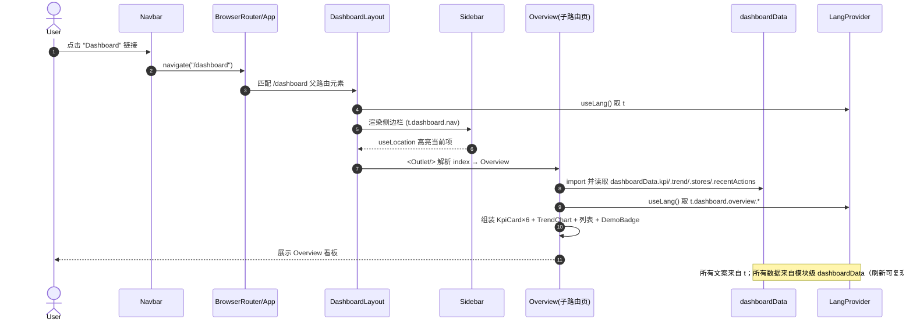
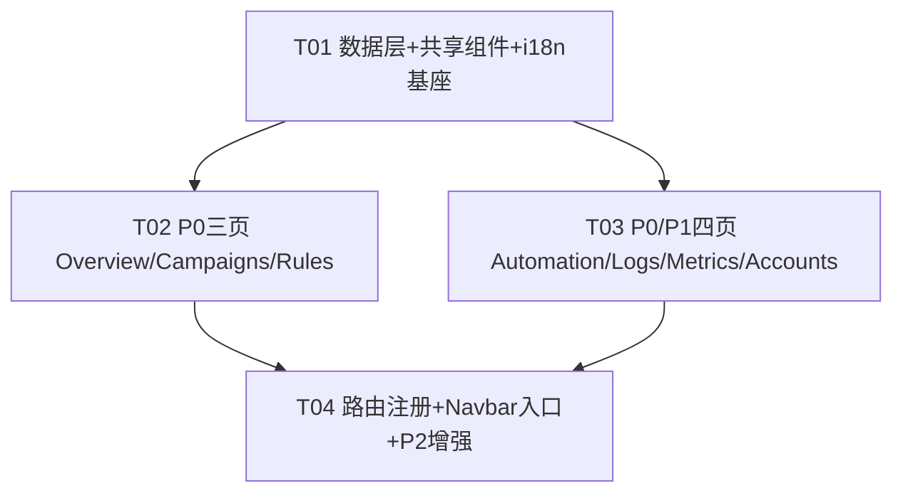

# GMVMAX 看板系统架构设计 + 任务分解

> 作者：架构师 高见远（Gao）｜基于 PRD（7 模块全做）与已拍板决策
> 现有项目：`gmvmax-draft/`（Vite + React + TS + MUI + Tailwind + react-router-dom v6）
> 本文件只含设计、接口、文件清单与有序任务列表，**不含业务代码**。

---

## Part A：系统设计

### 1. 实现方案 + 框架选型

**结论：沿用现有技术栈，零新增 npm 依赖，图表纯 SVG。**

| 维度 | 决策 | 理由 |
|------|------|------|
| 框架 | 沿用 Vite + React 18 + TypeScript + MUI v5 + Tailwind v3 + react-router-dom v6 | PRD 强制兼容现有骨架，不重建 |
| 路由 | 嵌套路由：`/dashboard` 作为父路由，`DashboardLayout` 渲染 `<Outlet/>` | react-router-dom v6 原生支持 `Outlet`，与现有 `App.tsx` 路由表风格一致 |
| 布局 | 新增 `DashboardLayout`（左 `Sidebar` + 右内容区）、`Sidebar` 用 `useLocation` 高亮 | 复用 MUI `Box` Grid + `useMediaQuery` 做响应式（参考现有 `Navbar`） |
| 数据层 | 新增 `src/dashboard-data.ts`：模块级 `buildDashboardData()` 一次性确定性构建全部数据 | 沿用 `demo-data.ts` 的确定性范式（无 `Math.random`），保证刷新可复现 |
| 确定性 | `mulberry32(hashSeed(str))` 小型 PRNG + 常量 `BASE_DATE` | 比 `demo-data` 的正弦波更适合批量生成 ≥30 日志/≥8 系列，仍 100% 可复现 |
| 图表 | 复用并泛化 `Demo.tsx` 的纯 SVG `TrendChart` 为可复用组件 | 零图表依赖，已验证可行 |
| 表格密度 | 看板区用更紧凑的 MUI `Table`（更小的 `size="small"`、`padding="none"`） | 沿用现有靛蓝浅色主题，不另建主题 |
| 状态管理 | 仅用 React 内置 `useState/useMemo/useContext`（LangProvider 已存在） | 无需 Redux/Zustand；P2 规则开关持久化用 `localStorage` |
| i18n | 扩展 `i18n.tsx` 的 `Content` 接口，新增 `dashboard` 段（zh/en 齐全） | 全部 UI 文案走 `t.dashboard.*`，默认 zh、`localStorage` 持久化 |

**核心难点与对策**
- *多模块共享数据 + 确定性*：所有数据在 `dashboard-data.ts` 模块加载时由 `buildDashboardData()` 构建一次，导出常量 `dashboardData`。页面直接 `import { dashboardData }`，无运行时随机。
- *系列-创意-商品三层 + 条件字段 ≥30*：用类型化的 `CampaignSeries → Creative → Product` 组合关系；`RuleConditionField` 枚举列出 **33** 个条件字段供表单选择。
- *5 种执行计划 + 可视化*：用 `PlanType` 联合类型（`budget|bid|switch|notify|batch`）+ `PlanCatalogItem[]` 描述每种计划的配置字段与触发统计；Rules 页用简单 SVG/连线展示「条件 → 动作」。

---

### 2. 文件列表（标注 新增 / 修改）

> 相对路径以项目根 `gmvmax-draft/` 为基准。

**新增（数据层 + 共享组件）**
| 文件 | 说明 |
|------|------|
| `src/dashboard-data.ts` | 核心 mock 数据层：全部 TS 类型 + 确定性生成函数 + 导出常量 `dashboardData` |
| `src/components/dashboard/DashboardLayout.tsx` | 看板外壳：左 Sidebar + 右 `<Outlet/>` 内容区（响应式） |
| `src/components/dashboard/Sidebar.tsx` | 左侧导航，7 个子路由入口，按 `useLocation` 高亮 |
| `src/components/dashboard/KpiCard.tsx` | 复用型 KPI 指标卡（label/value/delta/icon） |
| `src/components/dashboard/TrendChart.tsx` | 复用型纯 SVG 折线图（支持 1–2 条 series） |
| `src/components/dashboard/DataTable.tsx` | 复用型紧凑表格：列定义 `Column<T>[]` + `rows: T[]` |
| `src/components/dashboard/PageHeader.tsx` | 页面标题 + 副标题 + 右侧操作区（统一页头） |
| `src/components/dashboard/DemoBadge.tsx` | 「演示数据 / Demo Data」底部标识，全看板页复用 |
| `src/components/dashboard/StateView.tsx` | P2：空态 / Loading 态占位（各页条件渲染复用） |
| `src/components/dashboard/ExportCsvButton.tsx` | P2：CSV 导出示意按钮（生成 blob 下载，纯前端） |
| `src/hooks/useRuleToggle.ts` | P2：规则开关 `localStorage` 持久化（键 `gmvmax-rules`） |

**新增（7 个模块页面）**
| 文件 | 模块 |
|------|------|
| `src/pages/dashboard/Overview.tsx` | P0-2 Overview |
| `src/pages/dashboard/Campaigns.tsx` | P0-3 Campaigns |
| `src/pages/dashboard/Rules.tsx` | P0-4 Rules |
| `src/pages/dashboard/Automation.tsx` | P0-5 Automation |
| `src/pages/dashboard/Logs.tsx` | P0-6 Logs |
| `src/pages/dashboard/Metrics.tsx` | P1 Metrics |
| `src/pages/dashboard/Accounts.tsx` | P1 Accounts |

**修改（接入现有骨架）**
| 文件 | 改动 |
|------|------|
| `src/App.tsx` | 新增 `/dashboard` 父路由 + 7 条子路由（index→Overview），元素用 `DashboardLayout` |
| `src/components/Navbar.tsx` | 顶部导航新增「Dashboard」入口（来自 `t.dashboard.nav`），高亮逻辑兼容 |
| `src/i18n.tsx` | 扩展 `Content` 接口增加 `dashboard` 段；`zh`/`en` 各补齐全套看板文案 |

---

### 3. 数据结构与接口（TypeScript 类型）

> 完整图见 `class-diagram.mermaid`。`LocalizedText` 直接复用 `demo-data.ts` 的导出类型（避免重复定义）。

```ts
// ===== 复用 demo-data.ts =====
export type LocalizedText = { zh: string; en: string };
export type Lang = 'zh' | 'en';

// ===== 店铺 / 账户（Accounts，≥4）=====
export type StoreBindingStatus = 'connected' | 'pending' | 'error';
export interface Member {
  id: string;
  name: LocalizedText;
  role: LocalizedText; // 管理员 / 优化师 / 只读
}
export interface Store {
  id: string;
  name: LocalizedText;
  advertiser: LocalizedText;     // 所属广告主
  type: LocalizedText;           // 店铺类型（TikTok Shop / 独立站）
  region: LocalizedText;         // 地区
  bindingStatus: StoreBindingStatus;
  gmvSummary: number;            // 近 14 日 GMV 汇总
  currency: string;              // 结算币种，如 'USD'
  members: Member[];
}

// ===== 系列-创意-商品 三层（Campaigns，系列 ≥8）=====
export type CampaignStatus = 'active' | 'paused' | 'ended';
// 「层级」筛选维度：营销目标层级（内部决策，见 §5 待明确事项）
export type CampaignObjective = 'awareness' | 'consideration' | 'conversion';

export interface Product {
  id: string;
  name: LocalizedText;
  sku: string;
  price: number;
  gmv: number;
  orders: number;
  conversions: number;
}
export interface Creative {
  id: string;
  name: LocalizedText;
  status: CampaignStatus;
  impressions: number;
  clicks: number;
  ctr: number;        // 百分比数值（如 4.6 表示 4.6%）
  products: Product[];
}
export interface CampaignSeries {
  id: string;
  name: LocalizedText;
  storeId: string;
  status: CampaignStatus;
  objective: CampaignObjective;
  budget: number;
  spend: number;
  gmv: number;
  roas: number;
  conversions: number;
  creatives: Creative[];
}

// ===== 规则（Rules，≥8；条件字段 ≥30）=====
// 33 个条件字段（满足「≥30」）
export type RuleConditionField =
  | 'gmv' | 'spend' | 'roas' | 'ctr' | 'cvr' | 'cpa' | 'cpc' | 'impressions'
  | 'clicks' | 'conversions' | 'orders' | 'budgetUsage' | 'frequency'
  | 'reach' | 'videoViewRate' | 'addToCart' | 'checkout' | 'refundRate'
  | 'newCustomerRatio' | 'returnOnAdSpend' | 'costPerOrder' | 'aov'
  | 'engagementRate' | 'shareRate' | 'saveRate' | 'commentRate'
  | 'followRate' | 'liveViewers' | 'watchTime' | 'productClicks'
  | 'cartAbandonRate' | 'dayparting' | 'geoPerformance' | 'deviceType'
  | 'audienceOverlap' | 'creativeFatigue' | 'competitorShare';

export type RuleOperator = 'gt' | 'lt' | 'gte' | 'lte' | 'eq' | 'between' | 'change_pct';
export type ConditionUnit = 'pct' | 'currency' | 'count' | 'ratio';
export interface RuleCondition {
  field: RuleConditionField;
  operator: RuleOperator;
  value: number | [number, number];
  unit?: ConditionUnit;
}

// 5 种执行计划
export type PlanType = 'budget' | 'bid' | 'switch' | 'notify' | 'batch';
export interface Rule {
  id: string;
  name: LocalizedText;
  storeId: string;
  conditions: RuleCondition[];     // 条件→动作可视化的「条件」侧
  planType: PlanType;               // 条件→动作可视化的「动作」侧
  planConfig: Record<string, string | number>;
  enabled: boolean;                 // UI 开关态（P2 可 localStorage 持久化）
  lastTriggered: string;            // ISO 时间 或 '—'
  triggerCount: number;
}

// ===== Automation：5 种执行计划目录 =====
export interface PlanConfigField {
  key: string;
  label: LocalizedText;
  kind: 'number' | 'select' | 'text';
  options?: LocalizedText[];        // kind==='select' 时
}
export interface PlanCatalogItem {
  type: PlanType;
  title: LocalizedText;
  desc: LocalizedText;
  configFields: PlanConfigField[];
  triggerCount: number;
}

// ===== Metrics（创意/商品维度明细）=====
export type MetricDimension = 'creative' | 'product';
export interface MetricRow {
  id: string;
  dimension: MetricDimension;
  name: LocalizedText;
  parent: LocalizedText;            // 所属系列 / 创意
  impressions: number;
  clicks: number;
  ctr: number;
  gmv: number;
  orders: number;
  conversions: number;
  roas: number;
}

// ===== Logs（≥30 条）=====
export type LogResult = 'applied' | 'notified' | 'skipped' | 'failed';
export interface LogEntry {
  id: string;
  time: string;                     // ISO 时间
  storeId: string;
  ruleId: string;
  ruleName: LocalizedText;
  action: LocalizedText;
  planType: PlanType;
  result: LogResult;
  impactGmv: number;                // 影响 GMV（可正可负）
}

// ===== Overview KPI 快照 =====
export interface KpiSnapshot {
  gmv: number;
  spend: number;
  roas: number;
  conversions: number;
  orders: number;
  ctr: number;
  deltas: {
    gmv: number; spend: number; roas: number;
    conversions: number; orders: number; ctr: number;
  };
}
export interface RecentAction {
  id: string;
  time: string;
  store: LocalizedText;
  ruleName: LocalizedText;
  action: LocalizedText;
  result: LogResult;
}

// ===== 聚合根 =====
export interface DashboardData {
  stores: Store[];                 // ≥4
  campaigns: CampaignSeries[];     // ≥8
  rules: Rule[];                   // ≥8
  planCatalog: PlanCatalogItem[];  // 5
  metrics: MetricRow[];
  logs: LogEntry[];                // ≥30
  kpi: KpiSnapshot;
  recentActions: RecentAction[];
  trend: { date: string; gmv: number; spend: number }[];
}

// ===== 确定性生成函数签名（模块级，导出常量）=====
export function hashSeed(input: string): number;          // FNV-1a → uint32
export function mulberry32(seed: number): () => number;   // 确定性 PRNG，返回 [0,1)
export function makeLocalized(zh: string, en: string): LocalizedText;
export function buildDashboardData(): DashboardData;      // 构建全部数据
export const dashboardData: DashboardData;                // = buildDashboardData()
```

---

### 4. 程序调用流程（时序图）

> 完整图见 `sequence-diagram.mermaid`。



**i18n 注入方式**：`main.tsx` 已在根挂载 `LangProvider`，任何看板组件调用 `useLang()` 即可拿到 `t`。Sidebar/页面标题/表头/按钮全部从 `t.dashboard.<module>.<key>` 取值，语言切换即时生效（无需刷新）。

---

### 5. 待明确事项（已尽量内部解决，仅列假设）

| # | 事项 | 处理（假设 / 决策） |
|---|------|---------------------|
| 1 | 「按状态/层级筛选」中的「层级」含义 | 解读为**营销目标层级** `CampaignObjective`（awareness/consideration/conversion），作为系列表的第二筛选维度；原三层（系列-创意-商品）用于行展开。若主理人认为「层级」指其它含义，仅需改 `CampaignObjective` 枚举值，不影响结构 |
| 2 | KPI「订单 orders」来源 | 由 `conversions` 按确定性系数派生（`orders ≈ conversions × 0.62`，系数固定保证可复现），不另造随机 |
| 3 | Accounts 是否独立路由 | 按拍板决策，**独立** `/dashboard/accounts` 路由（非 Overview 内联） |
| 4 | P2 CSV 导出 | 「示意」实现：点击生成 `Blob` 前端下载，不接后端；按钮文案来自 `t.dashboard.common.exportCsv` |
| 5 | P2 规则开关持久化 | `localStorage` 键 `gmvmax-rules`，存 `{ [ruleId]: boolean }`；P0 阶段仅切换 UI state，P2 再接 `useRuleToggle` |
| 6 | P2 Overview 近 7/30 天切换 | 增加 `range: '7d'|'30d'` 本地 state，`trend` 预生成 30 天，按 range 截取；P0 先固定 14 天（沿用现有 `BASE_DATE` 范式） |
| 7 | 英文文案 | 全部自拟、IP 合规，不参考任何对标产品原文（遵守拍板决策 5） |

---

## Part B：任务分解

### 6. 依赖包列表

**零新增 npm 依赖。** 全部复用现有 `package.json`：

```
- react@^18.3.1 / react-dom@^18.3.1：UI 框架
- react-router-dom@^6.27.0：嵌套路由 + Outlet（已支持）
- @mui/material@^5.16.7 + @mui/icons-material@^5.16.7：组件库
- @emotion/react + @emotion/styled：MUI 样式引擎
- tailwindcss@^3.4.14 + postcss + autoprefixer：原子化样式
- vite@^5.4.10 + typescript@^5.6.3：构建与类型
```

> 图表、CSV、PRNG 全部自实现（纯 SVG / Blob / mulberry32），不引入 `recharts`/`d3`/`file-saver` 等。

---

### 7. 任务列表（有序、含依赖，≤5 个）

> 规则：T01 必为基础设施；每任务 ≥3 文件；任务主要依赖 T01，减少线性链。

| 任务 | 名称 | 源文件（新增/修改） | 依赖 | 优先级 | 一句话产出 |
|------|------|---------------------|------|--------|-----------|
| **T01** | 数据层 + 共享组件 + i18n 基座 | 新增：`dashboard-data.ts`、`components/dashboard/{DashboardLayout,Sidebar,KpiCard,TrendChart,DataTable,PageHeader,DemoBadge}.tsx`；修改：`i18n.tsx`（加 `dashboard` 段） | 无（仅依赖现有骨架） | P0 | 建立全部 TS 类型、确定性 `dashboardData`、可复用布局/图表/表格组件与全套 i18n 文案，供所有页面消费 |
| **T02** | P0 核心三页（Overview / Campaigns / Rules） | 新增：`pages/dashboard/{Overview,Campaigns,Rules}.tsx` | T01 | P0 | 实现 Overview（6 KPI+双折线+店铺列表+近期动作）、Campaigns（三层表格+筛选+展开）、Rules（列表+新建表单+条件→动作可视化） |
| **T03** | P0/P1 四页（Automation / Logs / Metrics / Accounts） | 新增：`pages/dashboard/{Automation,Logs,Metrics,Accounts}.tsx` | T01 | P0/P1 | 实现 Automation（5 计划卡+配置+触发统计）、Logs（≥30 表格+筛选）、Metrics（创意/商品明细+SVG 趋势）、Accounts（≥4 店铺/账户列表） |
| **T04** | 路由注册 + Navbar 入口 + P2 增强 | 修改：`App.tsx`、`components/Navbar.tsx`；新增：`components/dashboard/{StateView,ExportCsvButton}.tsx`、`hooks/useRuleToggle.ts` | T01,T02,T03 | P0/P2 | 把 7 页接入 `/dashboard` 嵌套路由、Navbar 加入口，并完成 P2（规则持久化/空Loading态/CSV示意/7-30天切换） |

> 依赖关系：`T01 → {T02, T03} → T04`。T02 与 T03 互不依赖，可在 T01 后并行。

---

### 8. 共享知识（跨文件约定）

**i18n key 命名约定**
- 根键：`t.dashboard`，下分模块：`nav / common / overview / campaigns / rules / automation / metrics / logs / accounts`。
- Sidebar 项来自 `t.dashboard.nav`（数组 `{ key, label, to }`），新增/调整菜单只改此处 + `App.tsx` 路由。
- 类型扩展：在 `i18n.tsx` 的 `Content` 接口加 `dashboard: DashboardContent`；`DashboardContent` 形状由架构在此锁定（见上方类型与 §2 文案段）。
- 英文全部自拟、IP 合规；默认 `lang==='zh'`；`localStorage` 键沿用现有 `gmvmax-lang`。

**SVG 图表组件 `TrendChart` props 约定**
```ts
interface TrendSeries { label: string; color: string; points: number[]; }
interface TrendChartProps {
  series: TrendSeries[];        // 1~2 条
  xLabels: string[];            // 与 points 等长
  height?: number;              // 默认 260
  areaFill?: boolean;           // 首条 series 是否填充面积
}
```
- 内部用 `viewBox="0 0 680 H"` + `width="100%"` 响应式；数值轴 `maxVal = max(...all)`，y 映射 `padT + innerH*(1 - v/maxVal)`；网格线 5 等分。
- 颜色优先取 `theme.palette.primary.main` / `secondary.main`，保持靛蓝调性。

**`DataTable` 列定义复用约定**
```ts
interface Column<T> {
  key: string;
  header: string;                          // 已 i18n 后的字符串
  align?: 'left' | 'right' | 'center';
  render?: (row: T) => React.ReactNode;    // 缺省显示 row[key]
  sortable?: boolean;
}
// 用法：<DataTable<T> columns={cols} rows={rows} dense />
```
- 所有看板表格统一用此组件 + `size="small"` 紧凑密度；筛选/分页状态由各页本地 `useState` 维护。

**Mock 数据确定性约定**
- 仅 `dashboard-data.ts` 模块加载时调用 `buildDashboardData()` 一次；禁止在组件内调用随机生成。
- 统一常量 `BASE_DATE = new Date(2026, 6, 25)`（与 `demo-data.ts` 对齐），日志/趋势日期以其为基准确定性偏移。
- PRNG：`mulberry32(hashSeed(id))`，`hashSeed` 用 FNV-1a；所有数值由 `(seed() 偏移)` 推导，保证相同输入恒等输出。
- `LocalizedText` 复用 `demo-data.ts` 导出类型，不再重复定义。

**演示数据标识复用**
- 每个看板页底部统一渲染 `<DemoBadge />`，文案 `t.dashboard.common.demoData`（「演示数据 / Demo Data」）。
- P2 空/Loading 态用 `<StateView kind="empty|loading" title={t...} />` 统一占位。

**数值格式化**（集中放在 `dashboard-data.ts` 或页面内复用 `Demo.tsx` 既有函数）：`formatCurrency / formatRoas / formatInt / formatPct / formatDelta`，与现有 Demo 页一致。

---

### 9. 任务依赖图


